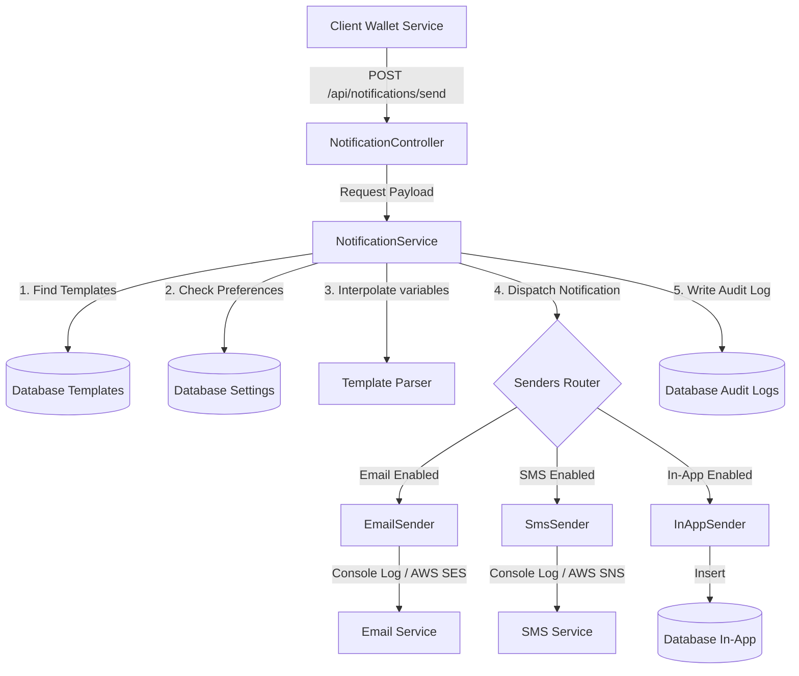

# Notification Microservice Documentation & Architecture

This document describes the design, schema, and API flow of the Notification Microservice built with Spring Boot and JDBI.

## Architecture Overview

The microservice provides a decoupled, template-based notification pipeline supporting Email, SMS, and In-App delivery. Senders are abstract interfaces allowing seamless future migration to AWS services (SES, SNS, etc.). It implements user preference control so recipients can opt-out of specific channels.

### System Flow Diagram



---

## Database Schemas

The application uses an H2 in-memory database for development, initialized via `schema.sql` and seeded with default transaction/onboarding templates via `data.sql`.

### 1. `notification_templates`
Stores message templates. Supports subject lines (for email) and body text with dynamic variables (e.g. `{{amount}}`).
*   `template_key` (VARCHAR, PK) - Unique key of the event (e.g., `WALLET_CREDITED`).
*   `channel` (VARCHAR, PK) - Delivery channel: `EMAIL`, `SMS`, or `IN_APP`.
*   `subject_template` (VARCHAR, Nullable) - Email subject lines or notification titles.
*   `body_template` (VARCHAR) - Core content template containing `{{variable}}` placeholders.
*   `created_at`, `updated_at` (TIMESTAMP)

### 2. `notification_settings`
Manages user opt-in/opt-out status for each delivery channel.
*   `user_id` (VARCHAR, PK) - Unique recipient identifier.
*   `email_enabled` (BOOLEAN) - Default: `TRUE`.
*   `sms_enabled` (BOOLEAN) - Default: `TRUE`.
*   `in_app_enabled` (BOOLEAN) - Default: `TRUE`.
*   `created_at`, `updated_at` (TIMESTAMP)

### 3. `in_app_notifications`
Holds notifications delivered directly inside the wallet application.
*   `id` (BIGINT, PK, Auto-increment)
*   `user_id` (VARCHAR) - Recipient identifier.
*   `title` (VARCHAR) - Header of the notification.
*   `content` (VARCHAR) - Rendered body text.
*   `is_read` (BOOLEAN) - Default: `FALSE`. Indicates if read by the user.
*   `created_at` (TIMESTAMP)

### 4. `notification_logs`
Audit logs capturing every attempt, status, and failure reason.
*   `id` (BIGINT, PK, Auto-increment)
*   `user_id` (VARCHAR)
*   `template_key` (VARCHAR)
*   `channel` (VARCHAR) - `EMAIL`, `SMS`, or `IN_APP`.
*   `status` (VARCHAR) - Outcomes: `SENT`, `FAILED`, `OPTED_OUT`.
*   `recipient_email`, `recipient_phone` (VARCHAR) - Contact values used at delivery.
*   `subject`, `body` (VARCHAR) - Fully rendered message content.
*   `error_message` (VARCHAR, Nullable) - Details of errors if status is `FAILED`.
*   `created_at` (TIMESTAMP)

---

## Core API Endpoints

### 1. Send Notification
Dispatches templates using recipient settings.
*   **POST** `/api/notifications/send`
*   **Request Body**:
    ```json
    {
      "userId": "user_1",
      "templateKey": "WALLET_CREDITED",
      "channels": ["EMAIL", "SMS", "IN_APP"],
      "parameters": {
        "username": "Alice",
        "amount": "$150.00",
        "senderName": "Bob",
        "balance": "$850.00"
      },
      "recipientEmail": "alice@example.com",
      "recipientPhone": "+15551234"
    }
    ```
*   **Response Body**:
    ```json
    {
      "EMAIL": "SENT",
      "SMS": "OPTED_OUT",
      "IN_APP": "SENT"
    }
    ```

### 2. User Settings
Gets and saves channel preferences.
*   **GET** `/api/notifications/settings/{userId}`
*   **PUT** `/api/notifications/settings/{userId}`
*   **Payload**:
    ```json
    {
      "userId": "user_1",
      "emailEnabled": true,
      "smsEnabled": false,
      "inAppEnabled": true
    }
    ```

### 3. In-App Notifications
Fetches recent in-app messages and marks them read.
*   **GET** `/api/notifications/in-app?userId={userId}`
*   **POST** `/api/notifications/in-app/{id}/read`

### 4. Template Manager
Provides CRUD functionality for database-based templates.
*   **GET** `/api/templates`
*   **GET** `/api/templates/{key}`
*   **POST** `/api/templates`
*   **DELETE** `/api/templates/{key}/{channel}`
